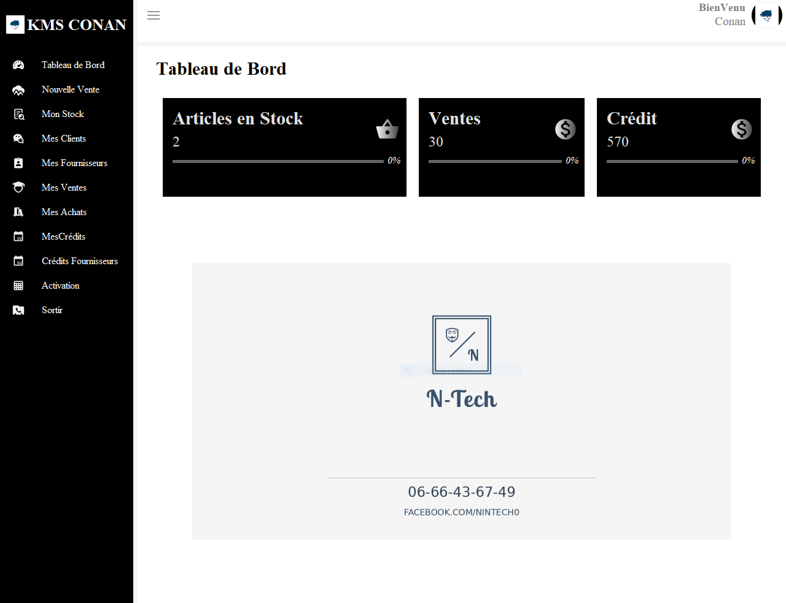
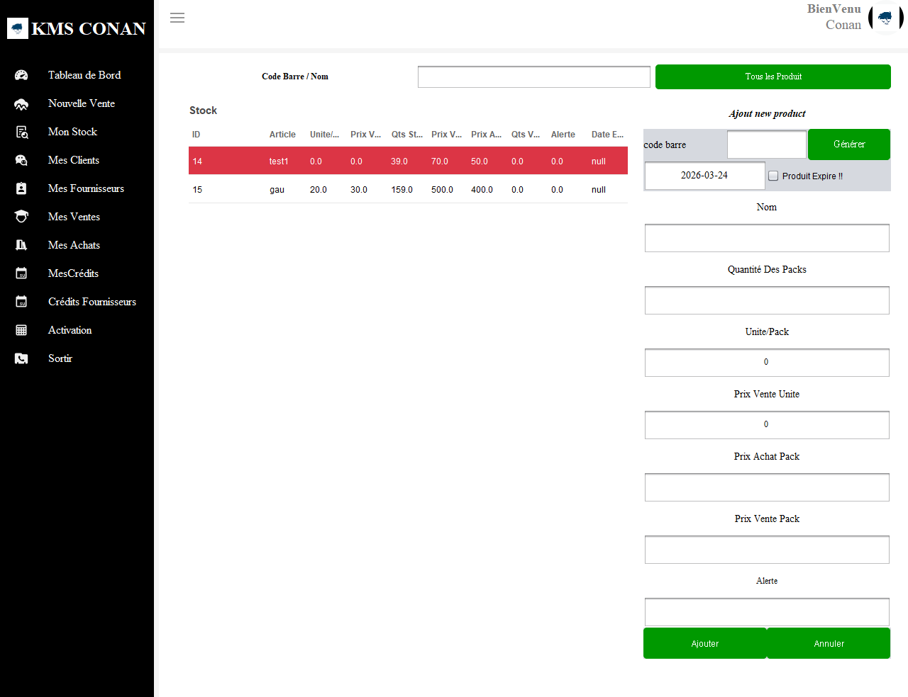
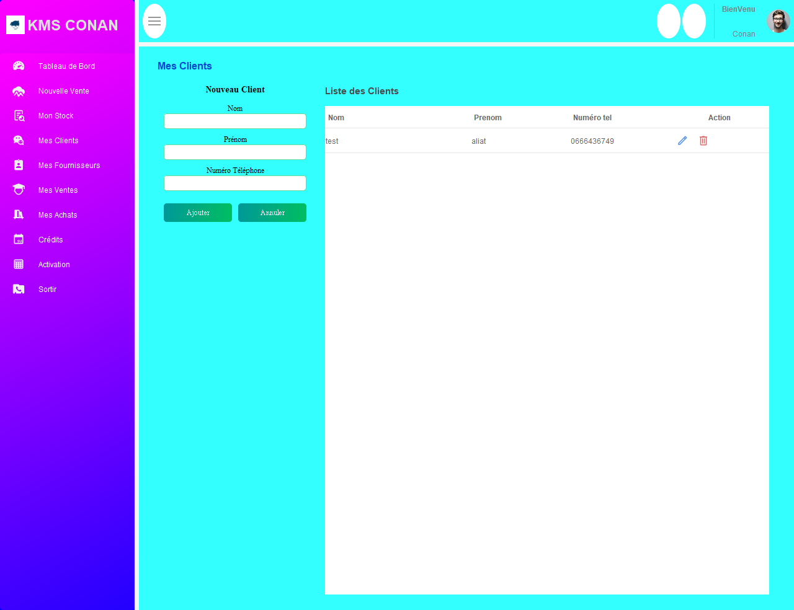
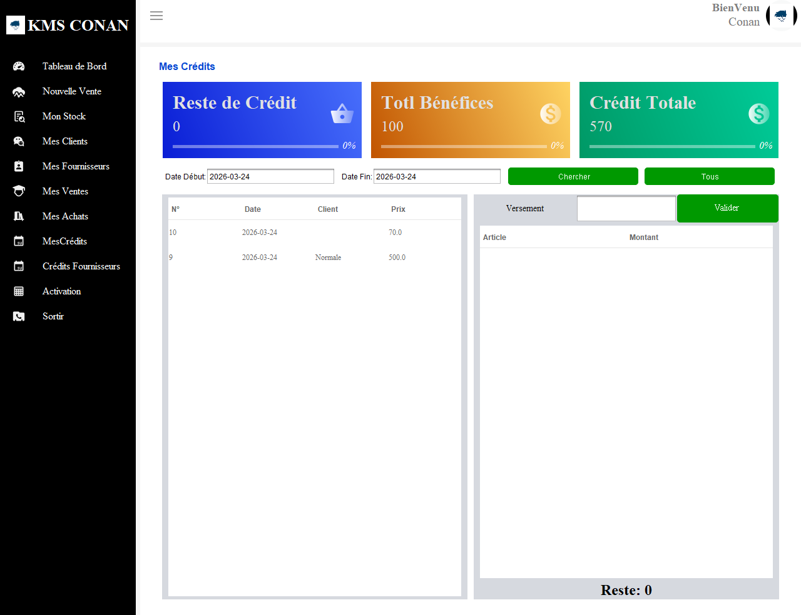
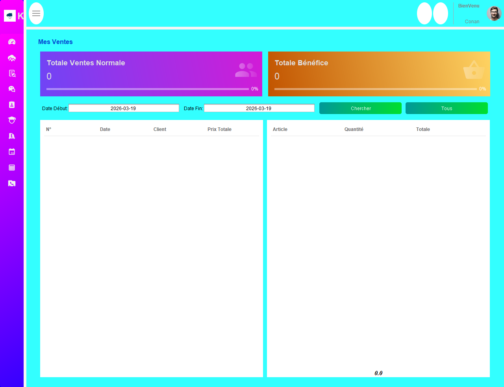
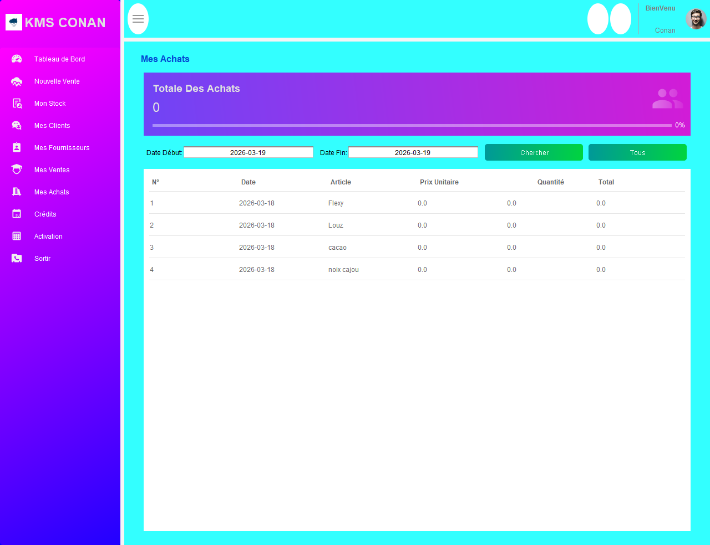
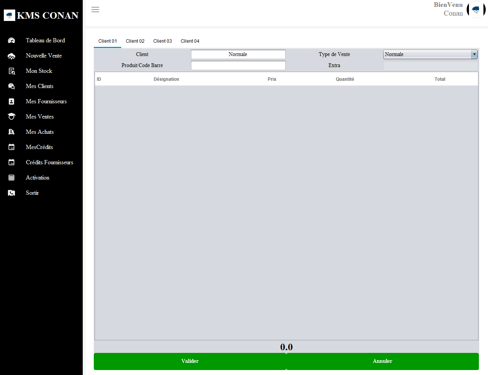

# Inventory Management System

---
## 🌐 Project Overview
Desktop application for managing inventory, sales, clients, and suppliers.

---
## 📌 Table of Contents
- About
- Technologies Used
- Key Features
- Project Architecture
- Screenshots
- Source Code Notice
- Developed By

---
# 📌 About
This project represents a freelance desktop application developed in 1 week for managing business operations.

The system includes:
- Inventory & stock tracking  
- Sales and purchases management  
- Client and supplier management  
- Credit tracking system  

The objective was to deliver a fast, functional, and modern desktop solution.

## 🎨 UI Inspiration
The user interface design is inspired by:
https://github.com/DJ-Raven/java-swing-school-management-dashboard

While the UI concept is inspired, the full application logic, architecture, and features were independently designed and implemented.
---
## 🛠 Technologies Used
### Frontend
- Java Swing (Custom UI)

### Backend
- Java
- SQLite (JDBC)

### Tools
- Eclipse IDE
- MigLayout
- FlatLaf

---
## ⚙ Key Features
- Stock management system
- Sales & purchase tracking
- Client & supplier management
- Credit tracking
- Modern UI dashboard
- Fast CRUD operations

---
## 🏗 Project Architecture
Frontend handles:
- UI components
- User interactions

Backend handles:
- Database operations
- Business logic

---
## 📸 Screenshots
### 📊 Dashboard

### 📦 Stock Management

### 👥 Client Management

### 💳 Credit Management

### 💰 Sales (My Sales)

### 🛒 Purchases (My Purchase)

### 🏷️ Selling Interface

---
## 🔒 Source Code Notice
This project was developed as a freelance solution.
Source code is shared for portfolio purposes.

---
## 👨‍💻 Developed By
ATEF Aliat

_Last Updated: March 2026_
